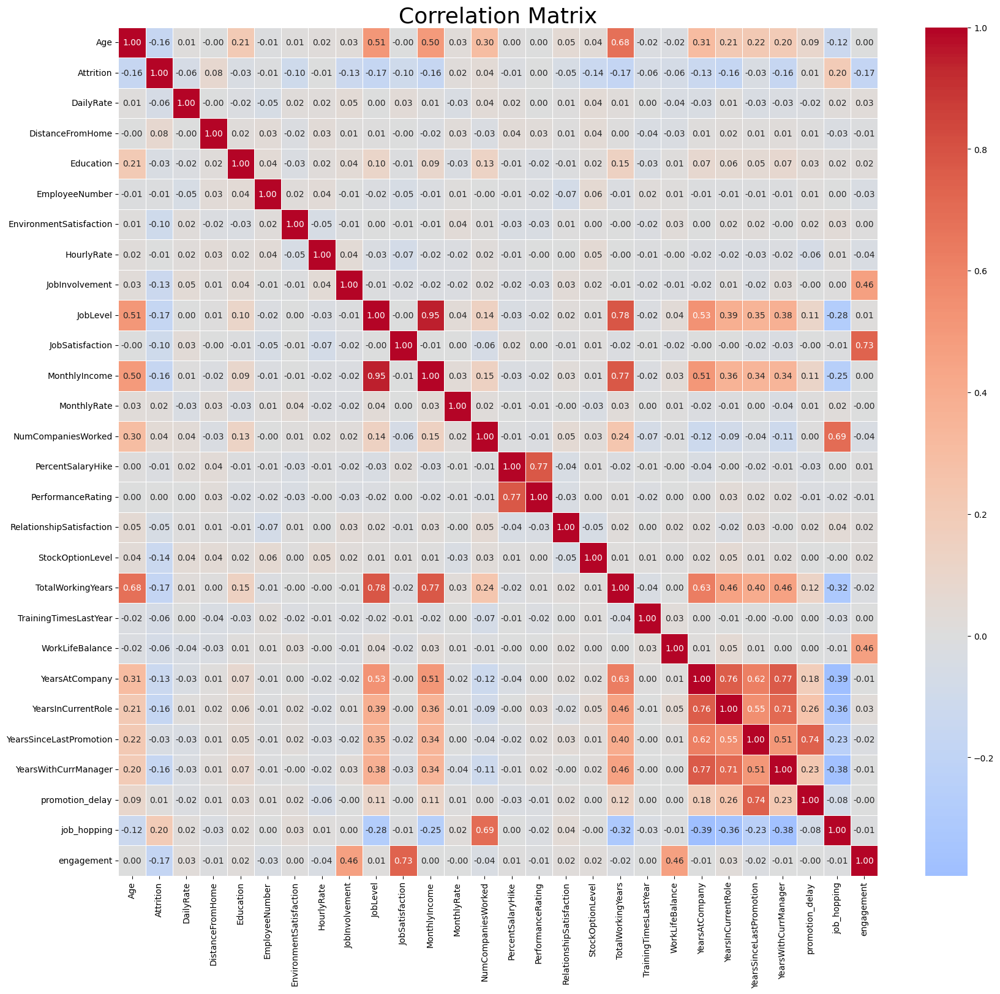
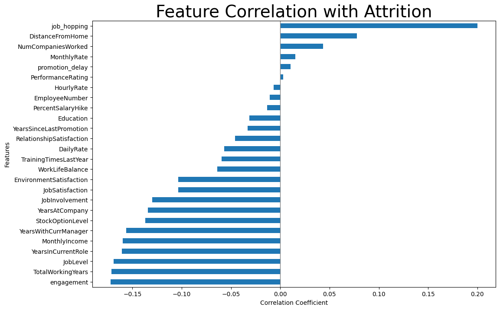
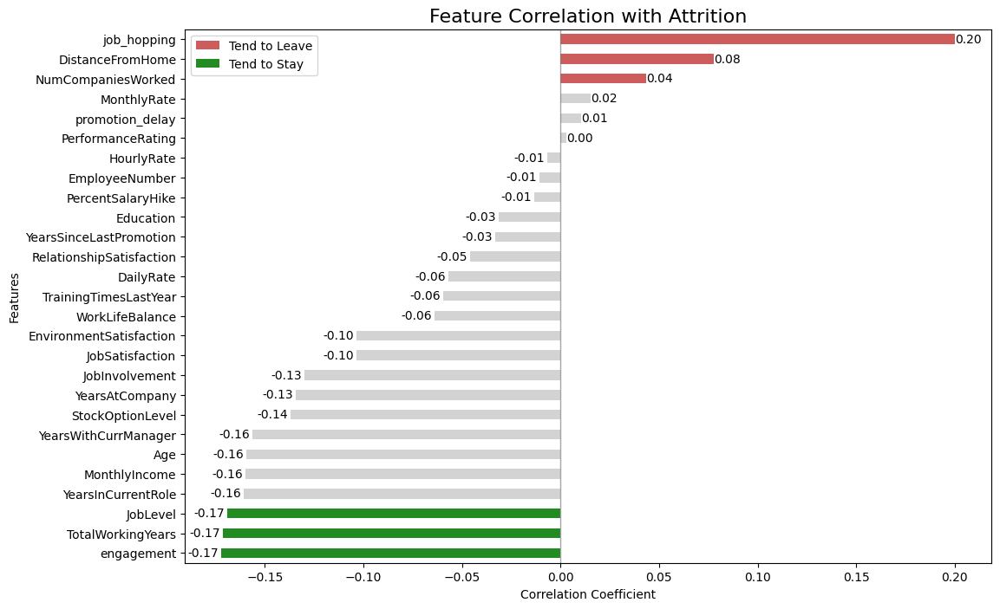

# HR Employee Attrition Analysis & Feature Engineering

## Project Overview

This project explores the main factors associated with employee attrition using exploratory data analysis (EDA), feature engineering, and correlation analysis.

Starting from a raw HR dataset, new engineered features were developed to capture behavioral and organizational patterns potentially linked to employee turnover.

The project focuses on building interpretable and semantically robust features rather than creating a large number of arbitrary metrics.

---

# Objectives

- Analyze employee attrition patterns
- Identify variables associated with employee turnover
- Develop meaningful engineered features
- Evaluate feature relationships through correlation analysis
- Produce clear business-oriented visualizations

---

# Dataset Information

The dataset contains employee-level information related to:

- demographics
- compensation
- job satisfaction
- work-life balance
- career progression
- organizational tenure
- performance indicators

Target variable:

| Variable  |     Description    |
| Attrition |     Indicates whether the employee left the company (`Yes`) or stayed (`No`) |

---

# Data Cleaning

The following constant columns were removed because they contained no analytical value:

- `EmployeeCount`
- `Over18`
- `StandardHours`

---

# Feature Engineering

After validating several candidate metrics, only the most interpretable and semantically consistent engineered features were retained.

## 1. Promotion Delay Ratio

Measures time without promotion relative to company tenure.

```python
df["promotion_delay"] = (
    df["YearsSinceLastPromotion"] /
    (df["YearsAtCompany"] + 1)
)
```

---

## 2. Job Hopping Index

Measures how frequently an employee has changed companies during their career.

```python
df["job_hopping"] = (
    df["NumCompaniesWorked"] /
    (df["TotalWorkingYears"] + 1)
)
```

---

## 3. Engagement Score

Aggregates employee satisfaction, involvement, and work-life balance into a single metric.

```python
df["engagement"] = (
    df["JobSatisfaction"] +
    df["JobInvolvement"] +
    df["WorkLifeBalance"]
)
```

---

# Correlation Analysis

The correlation analysis revealed several meaningful patterns associated with employee attrition.

## Main Positive Correlation
Higher values associated with increased attrition risk:

- `job_hopping`
- `DistanceFromHome`

## Main Negative Correlations
Higher values associated with employee retention:

- `engagement`
- `TotalWorkingYears`
- `JobLevel`
- `MonthlyIncome`
- `YearsInCurrentRole`

---

# Correlation Matrix



---

# Feature Correlation with Attrition



---
# Feature Correlation with Attrition Highlighted



---

# Key Insights

- Employees with a history of frequent company changes tend to leave more often.
- Higher engagement levels are strongly associated with employee retention.
- Senior employees and higher job levels show lower attrition rates.
- Compensation and financial incentives appear to contribute to retention.
- Organizational stability and managerial continuity are associated with lower turnover risk.

---

# Technologies Used

- Python
- Pandas
- NumPy
- Matplotlib
- Seaborn
- Google Colab

---

# Project Structure

```text
├── data/
│   └── NEW-hr_employee_attrition.csv
│
├── images/
│   ├── correlation_matrix.png
│   ├── barh-correlation.png
│   └── barh-correlation-highlighted.png
│
├── notebooks/
│   └── HR_employee_attrition_analysis_feature_engineering.ipynb
│
└── README.md
```

---

# Conclusion

This project demonstrates how carefully designed feature engineering and exploratory analysis can help uncover behavioral and organizational patterns associated with employee attrition.

Rather than maximizing the number of engineered variables, the project prioritizes interpretability, consistency, and business relevance.
